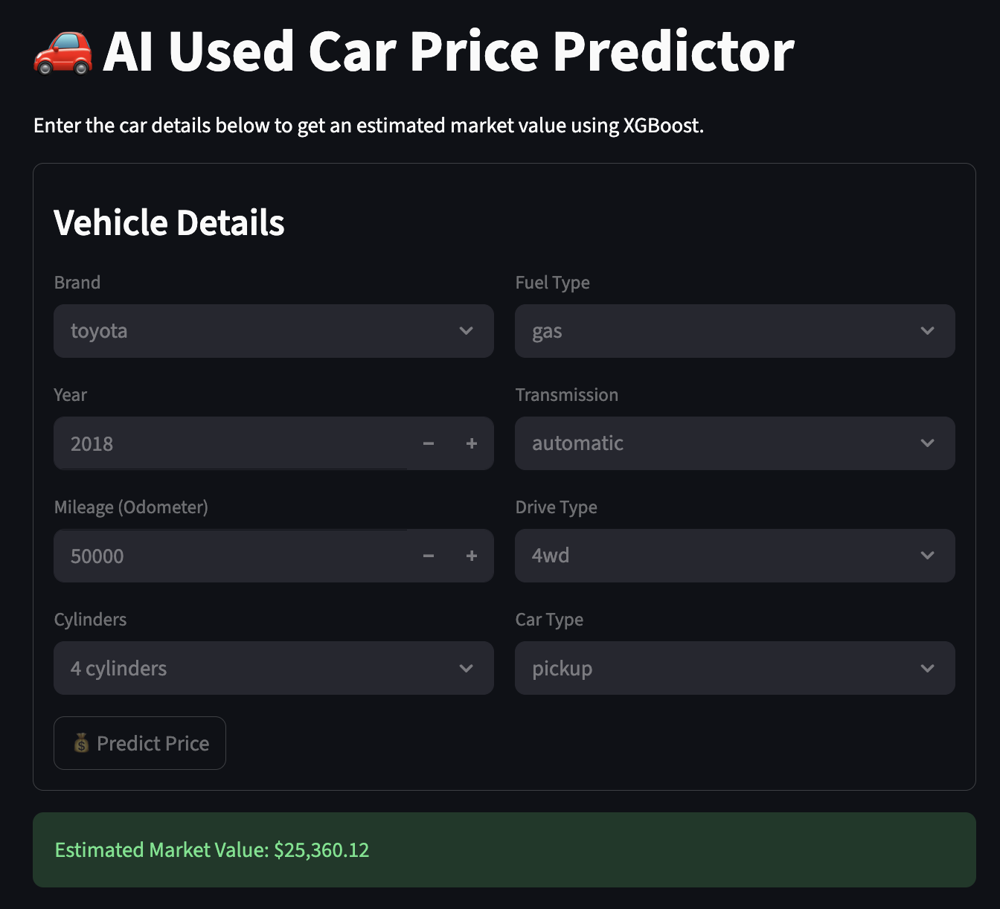

# 🚗 AI Used Car Price Predictor


live demo- https://carpricepredictor-ntyf6xmpzqwmloqy4jdg87.streamlit.app/


## 📖 Overview
Determining the fair market value of a used vehicle is difficult due to the complex interplay of age, mileage, brand, and condition. This project is a **Machine Learning Application** that predicts used car prices with **82% accuracy** (R² Score).

Trained on a dataset of **300,000+ real car listings**, the system uses an **XGBoost Regressor** to identify non-linear price curves (e.g., depreciation slows down after 5 years). The model is deployed via a **Streamlit Web App**, allowing users to get instant valuations.

## 🏗️ Architecture
The pipeline follows a standard Data Science lifecycle:

1.  **ETL & Cleaning:** Ingested raw Craigslist data, filtered "spam" listings ($0 cars), and imputed missing values using median statistics.
2.  **Feature Engineering:** Created a `car_age` feature and One-Hot Encoded categorical variables (Brand, Transmission, Drive Type).
3.  **Modeling:** Trained an **XGBoost Regressor** (Gradient Boosting) which outperformed Linear Regression by capturing complex relationships.
4.  **Deployment:** Built an interactive frontend using Streamlit to serve predictions in real-time.

## 📸 Screenshots
### The Prediction Interface
*(Predicting the value of a 2018 Toyota 4WD Pickup)*


## 📊 Model Performance
* **Algorithm:** XGBoost Regressor
* **R² Score:** 0.82 (Excellent fit)
* **Mean Absolute Error (MAE):** ~$3,800
* **Training Data:** 360,000+ cleaned records

## 🛠️ Tech Stack
* **Core:** Python, Pandas, NumPy
* **ML:** Scikit-Learn, XGBoost, Joblib
* **Web:** Streamlit
* **IDE:** PyCharm

## ⚡ How to Run
1.  **Clone the Repo:**
    ```bash
    git clone [https://github.com/YOUR_USERNAME/car-price-predictor.git](https://github.com/YOUR_USERNAME/car-price-predictor.git)
    ```
2.  **Install Dependencies:**
    ```bash
    pip install pandas xgboost scikit-learn streamlit
    ```
3.  **Run the App:**
    ```bash
    streamlit run app.py
    ```
